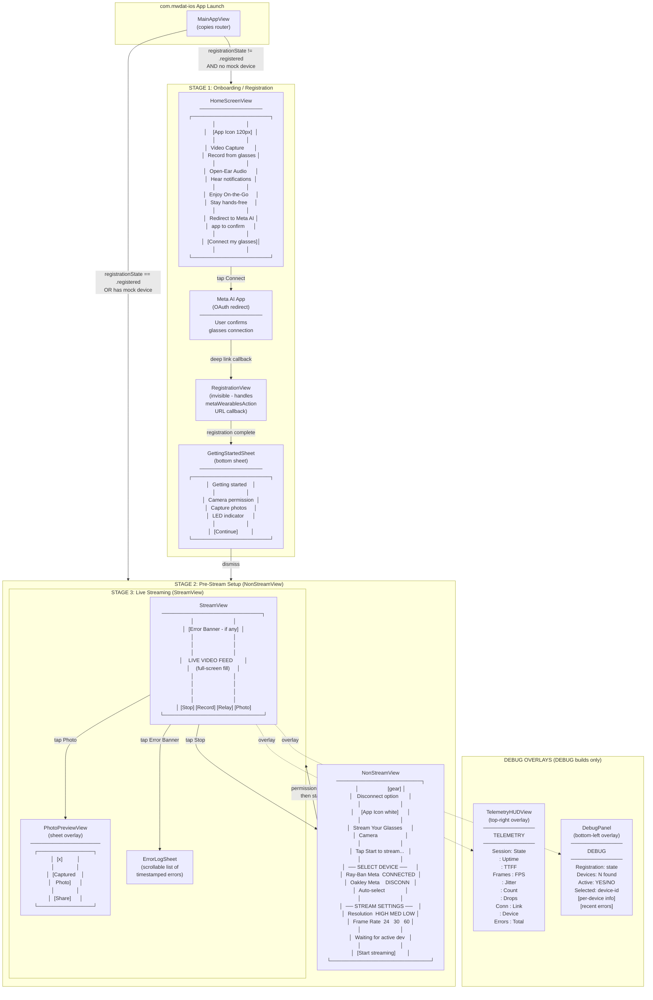

# UX Stages - com.mwdat-ios

## Wireframe Flow Diagram

## Summary of UX Stages

| Stage | View | Purpose |
|---|---|---|
| **1. Onboarding** | `HomeScreenView` | Welcome screen with feature highlights. "Connect my glasses" button redirects to Meta AI app for OAuth. |
| **1b. Registration** | `RegistrationView` (invisible) | Handles deep link callback from Meta AI app to complete registration. |
| **1c. Getting Started** | `GettingStartedSheet` (bottom sheet) | Post-registration tips about camera permissions, capture, and LED indicator. |
| **2. Pre-Stream Setup** | `NonStreamView` | Device picker (multi-device), stream config (resolution/frame rate), waiting for active device, and "Start streaming" button. |
| **3. Live Streaming** | `StreamView` | Full-screen video feed from glasses. Bottom controls: Stop, Record (toggle), Relay (toggle), Photo capture. |
| **3a. Photo Preview** | `PhotoPreviewView` (sheet) | Dismissible photo viewer with swipe-to-dismiss and share sheet. |
| **3b. Error Log** | `ErrorLogSheet` (sheet) | Timestamped error history. |
| **Debug** | `TelemetryHUDView` + `DebugPanel` | DEBUG-only overlays showing session metrics, frame stats, device info, and errors. |

The app is a single-flow linear progression: register -> configure -> stream. No tab bar or multi-screen navigation -- it's a focused camera streaming tool.
